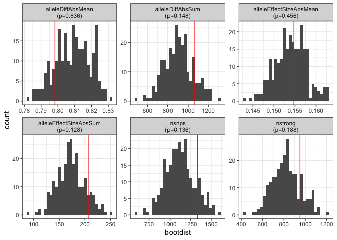

<!-- README.md is generated from README.Rmd. Please edit that file -->

# tfboot <a href='https://github.com/colossal-compsci/tfboot/'></a>

<!-- badges: start -->

[](https://github.com/colossal-compsci/tfboot/actions/workflows/R-CMD-check.yaml)
<!-- badges: end -->

The goal of tfboot is to facilitate statistical analysis of SNPs
disrupting transcription factor binding sites (TFBS) using bootstrapping
resampling to create empirical null distributions.

## Installation

You can install the development version of tfboot from
[GitHub](https://github.com/) with the code below. You’ll need to
replace `gh_pat` with your [personal access
token](https://docs.github.com/en/authentication/keeping-your-account-and-data-secure/creating-a-personal-access-token).

``` r
# First install devtools if you don't have it already
# install.packages("devtools")

# Set your personal access token
gh_pat="12345-abcde-CHANGEME-67890-xyz"

# Install directly from GitHub:
devtools::install_github(repo = "https://github.com/colossal-compsci/tfboot", 
                         auth_token = gh_pat, 
                         upgrade = FALSE, 
                         build_vignettes = TRUE, 
                         force = TRUE, 
                         dependencies = c("Imports", "Suggests"))
```

## Documentation

See the full introductory vignette with:

``` r
vignette("intro", package="tfboot")
```

## Example

Let’s use an example from the vignette. First, let’s load some pre-baked
motifbreakR results. `mbres` is a set of motifbreakR results run on SNPs
in the 5kb promoter region of a random selection of 5 genes. `mball` is
the precomputed set of motifbreakR results run on SNPs in the promoter
region of *all* genes.

``` r
library(tfboot)
```

``` r
mbres <- vignettedata$mbres
mbres
#> # A tibble: 1,335 × 10
#>    gene_id   SNP_id            tf    pctRef pctAlt scoreRef scoreAlt effect alleleDiff alleleEffectSize
#>    <chr>     <chr>             <chr>  <dbl>  <dbl>    <dbl>    <dbl> <chr>       <dbl>            <dbl>
#>  1 100316005 chr33:7472152_G/C ACE2   0.986  0.783     4.85     3.87 strong     -0.980          -0.199 
#>  2 100316005 chr33:7472176_T/G ADR1   0.759  0.917     3.34     4.01 weak        0.673           0.154 
#>  3 100316005 chr33:7471139_A/C AFT2   0.964  0.878     5.50     5.02 weak       -0.480          -0.0843
#>  4 100316005 chr33:7472176_T/G AFT2   0.902  0.740     5.15     4.24 strong     -0.911          -0.160 
#>  5 100316005 chr33:7473834_G/T AFT2   0.879  0.705     5.02     4.04 strong     -0.980          -0.172 
#>  6 100316005 chr33:7472152_G/C AGL42  0.859  0.693     5.14     4.15 strong     -0.986          -0.165 
#>  7 100316005 chr33:7471139_A/C AGL55  0.695  0.861     3.97     4.91 strong      0.939           0.165 
#>  8 100316005 chr33:7472830_A/T ALX3   0.972  0.776     4.23     3.43 strong     -0.806          -0.185 
#>  9 100316005 chr33:7473857_T/C ALX3   0.919  0.773     4.02     3.42 weak       -0.600          -0.138 
#> 10 100316005 chr33:7473583_G/A ARG80  0.731  0.961     3.16     4.15 strong      0.993           0.230 
#> # ℹ 1,325 more rows
mball <- vignettedata$mball
mball
#> # A tibble: 12,689 × 10
#>    gene_id   SNP_id            tf        pctRef pctAlt scoreRef scoreAlt effect alleleDiff alleleEffectSize
#>    <chr>     <chr>             <chr>      <dbl>  <dbl>    <dbl>    <dbl> <chr>       <dbl>            <dbl>
#>  1 100315917 chr33:5706617_C/T ARG80      0.979  0.749     4.23     3.24 strong     -0.993           -0.230
#>  2 100315917 chr33:5706617_C/T ARG81      0.991  0.825     5.89     4.90 strong     -0.982           -0.165
#>  3 100315917 chr33:5703167_G/T ARGFX      0.781  0.889     5.06     5.74 weak        0.677            0.105
#>  4 100315917 chr33:5706617_C/T ARR1       0.634  0.880     2.53     3.42 strong      0.892            0.231
#>  5 100315917 chr33:5707492_C/T AT1G19040  0.882  0.779     7.60     6.73 strong     -0.861           -0.100
#>  6 100315917 chr33:5704406_C/G AT3G46070  0.784  0.892     5.13     5.79 weak        0.666            0.103
#>  7 100315917 chr33:5706617_C/T ATHB-12    0.781  0.890     4.12     4.67 weak        0.552            0.106
#>  8 100315917 chr33:5706617_C/T ATHB-13    0.721  0.868     4.98     5.98 strong      0.993            0.145
#>  9 100315917 chr33:5706617_C/T ATHB-16    0.813  0.966     5.32     6.32 strong      0.998            0.153
#> 10 100315917 chr33:5706617_C/T ATHB-4     0.778  0.931     4.98     5.94 strong      0.963            0.151
#> # ℹ 12,679 more rows
```

Summarize motifbreakR results on our 5 genes of interest. This shows us
the actual values for the number of SNPs in the upstream regions of
these genes, and summary statistics on the allele differences, effect
sizes, etc. See the vignette and `?mb_summarize` for details.

``` r
mbsmry <- mb_summarize(mbres)
mbsmry
#> # A tibble: 1 × 7
#>   ngenes nsnps nstrong alleleDiffAbsMean alleleDiffAbsSum alleleEffectSizeAbsMean alleleEffectSizeAbsSum
#>    <int> <int>   <int>             <dbl>            <dbl>                   <dbl>                  <dbl>
#> 1      5  1335     950             0.798            1066.                   0.155                   206.
```

Bootstrap resample motifbreakR results for all genes. Resample sets of 5
genes 250 times.

``` r
set.seed(42)
mbboot <- mb_bootstrap(mball, ngenes=5, boots = 250)
mbboot$bootwide
#> # A tibble: 250 × 9
#>     boot genes                                    ngenes nsnps nstrong alleleDiffAbsMean alleleDiffAbsSum alleleEffectSizeAbsMean alleleEffectSizeAbsSum
#>    <int> <chr>                                     <int> <int>   <int>             <dbl>            <dbl>                   <dbl>                  <dbl>
#>  1     1 431304;426469;100315917;396544;374124         5  1062     750             0.797             847.                   0.155                   164.
#>  2     2 426183;395959;431304;429501;396170            5  1244     914             0.808            1005.                   0.157                   195.
#>  3     3 102465361;426183;396544;426469;429172         5   886     655             0.812             720.                   0.149                   132.
#>  4     4 396007;407779;693245;429501;100498692         5  1514    1139             0.815            1234.                   0.153                   232.
#>  5     5 426883;396544;408041;426183;426469            5   925     623             0.787             728.                   0.147                   136.
#>  6     6 425059;429035;100529062;396007;425613         5  1350    1026             0.821            1109.                   0.155                   209.
#>  7     7 408042;426880;100498692;425499;426885         5   823     627             0.823             677.                   0.157                   129.
#>  8     8 396170;425058;426886;395587;396045            5  1262     910             0.805            1016.                   0.147                   185.
#>  9     9 102466833;426183;100529061;396045;395959      5  1263     963             0.822            1038.                   0.153                   193.
#> 10    10 429035;408042;100529062;100529061;425613      5  1289     987             0.823            1061.                   0.154                   198.
#> # ℹ 240 more rows
mbboot$bootdist
#> # A tibble: 6 × 2
#>   metric                  bootdist   
#>   <chr>                   <list>     
#> 1 alleleDiffAbsMean       <dbl [250]>
#> 2 alleleDiffAbsSum        <dbl [250]>
#> 3 alleleEffectSizeAbsMean <dbl [250]>
#> 4 alleleEffectSizeAbsSum  <dbl [250]>
#> 5 nsnps                   <dbl [250]>
#> 6 nstrong                 <dbl [250]>
```

Compare the values from our five genes of interest to the empirical null
distribution from bootstrap resampling.

``` r
bootstats <- mb_bootstats(mbsmry, mbboot)
bootstats
#> # A tibble: 6 × 5
#>   metric                      stat bootdist     bootmax     p
#>   <chr>                      <dbl> <list>         <dbl> <dbl>
#> 1 nsnps                   1335     <dbl [250]> 1597     0.136
#> 2 nstrong                  950     <dbl [250]> 1210     0.188
#> 3 alleleDiffAbsMean          0.798 <dbl [250]>    0.831 0.836
#> 4 alleleDiffAbsSum        1066.    <dbl [250]> 1304.    0.148
#> 5 alleleEffectSizeAbsMean    0.155 <dbl [250]>    0.163 0.456
#> 6 alleleEffectSizeAbsSum   206.    <dbl [250]>  251.    0.128
```

Visualize the results:

``` r
plot_bootstats(bootstats)
```



See `vignette("intro", package="tfboot")` for more.
